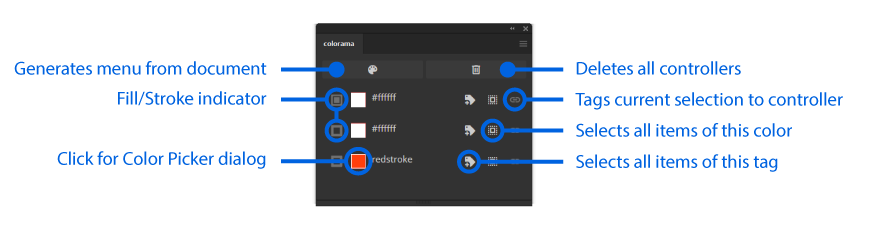

# colorama

After Effects inspired color controls for Illustrator

_[See above in HD](https://gfycat.com/idealdenseharvestmouse)_

## Installation and use

- [Download the ZXP by clicking here](https://github.com/Inventsable/colorama/raw/master/archive/colorama_1.0.0.zxp)
- Use a valid ZXP installer (like [ZXPInstaller](https://zxpinstaller.com/) or [Anastasiy's Extension Manager](https://install.anastasiy.com/)) and open the ZXP
- Relaunch Illustrator and find in Windows > Extensions > Pathfinder Plus

---

## UI

## Notes

- Due to scripting limitations, the panel will only recognize a single fill/stroke of any given item. It cannot read multiple strokes on the same object stacked in the Appearance panel
- Strokes/fills must be separate in the UI otherwise the panel will not know when to overwrite which color
- **When you generate the menu, it's best to rename all the color controls.** There is no duplicate tag name error detection, so naming two controls the same value (unless one is fill and one is stroke) will result in the panel writing the last modified color to each.
- Certain special characters like a the following `"-"` dash, quotes, periods, brackets, can't be supported as controller names and will result in the controllers not affecting any artwork. Try to use only alphanumeric characters (`a-zA-Z0-9` or space) within names.

## Context Menu

- `Scan User Selection` - Reactively enables/disables buttons unless user has selected items (may cause computing overhead on large documents)
- `Launch on mount` - Automatically launch and generate menu whenever panel is refreshed or program launches with panel open
- `Refresh Panel` - Reloads the extension
- `Copy debug URL` - Copies localhost URL of panel debugging port to clipboard which can access Chrome DevTools on the extension via the [CEFClient program found here](https://github.com/Adobe-CEP/CEP-Resources/tree/master/CEP_9.x)
